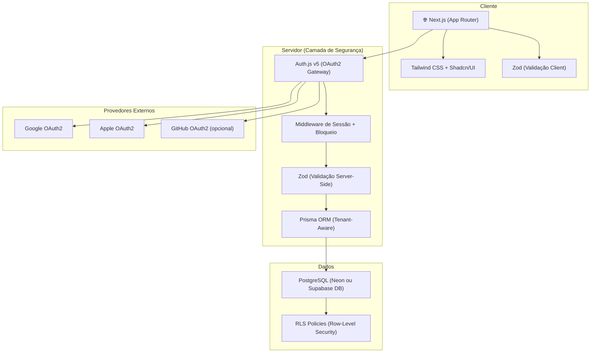
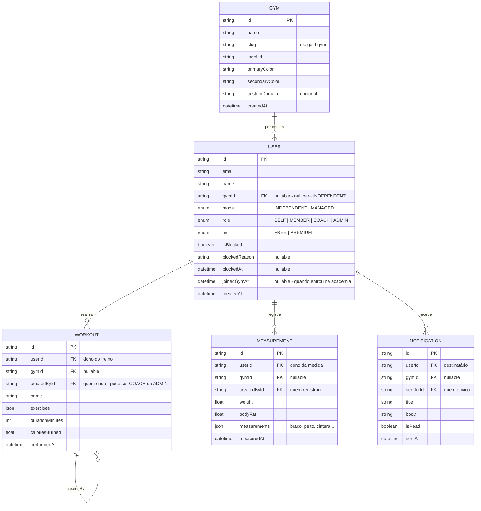
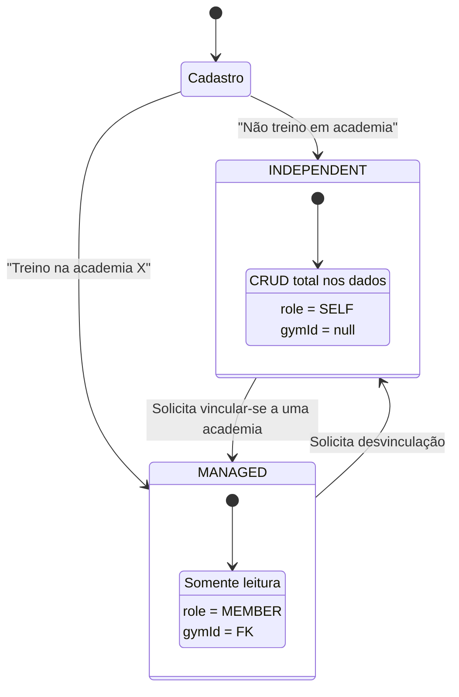
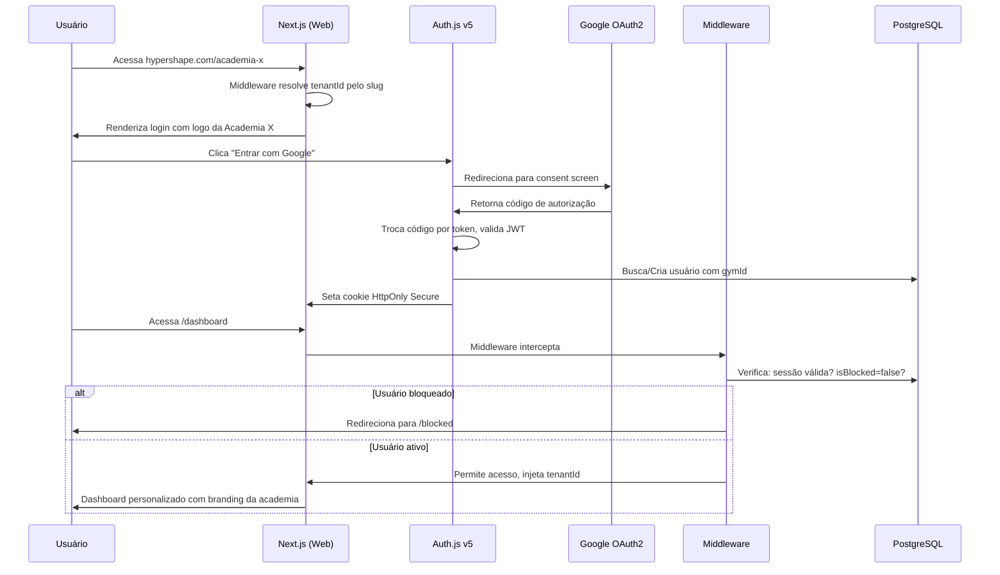
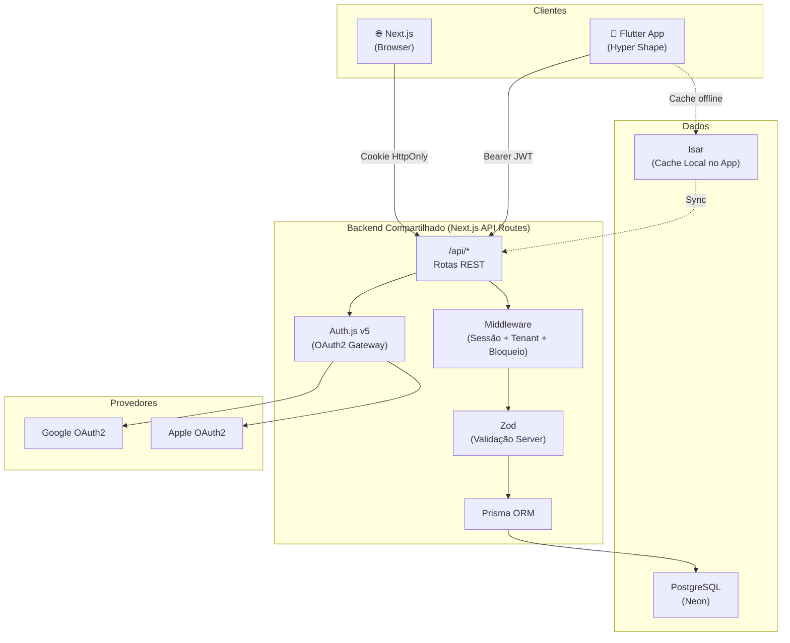
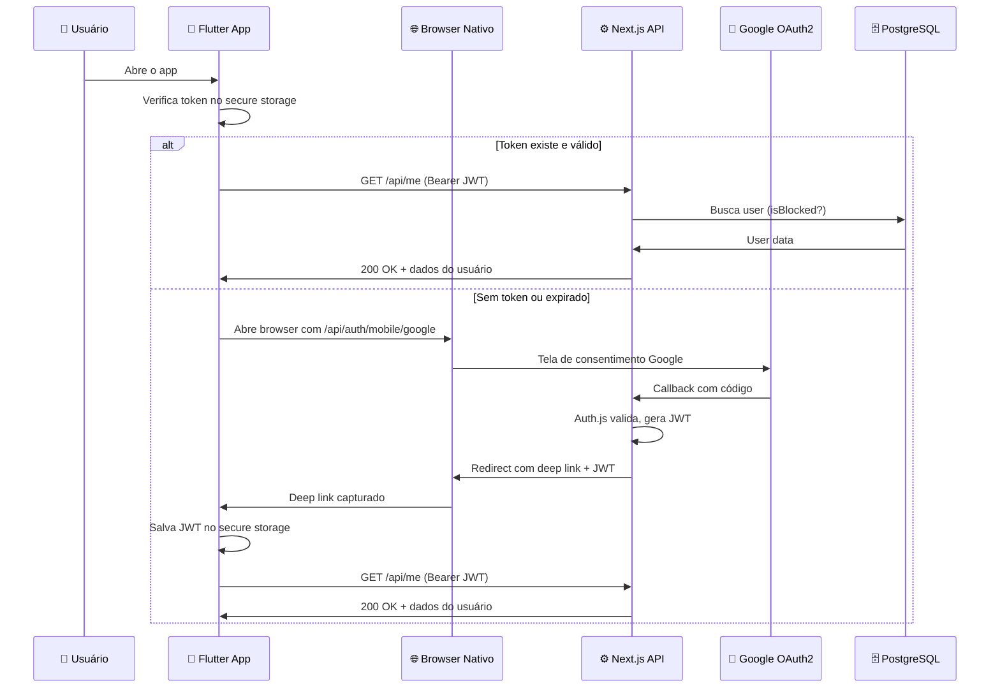
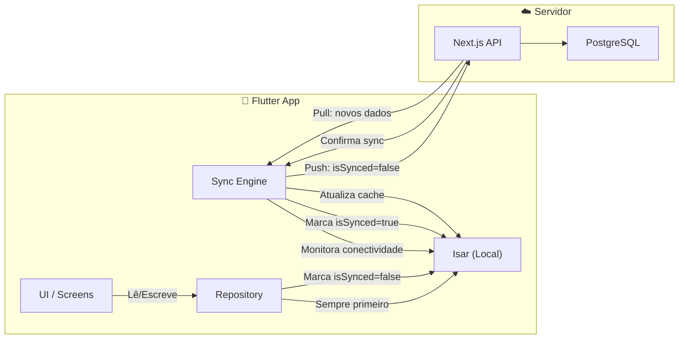

# Planejamento Completo — Hyper Shape Web (v3 Consolidado)

Documento unificado com: Visão de Produto, Arquitetura, Segurança em Camadas, Multi-Tenant, Monetização, Integração com o App Flutter, e Estratégia de Sincronização.

---

## 1. Visão de Produto (Product Manager Toolkit)

### 1.1 Problema e Oportunidade
O app mobile Hyper Shape atende bem o usuário durante o treino, mas precisa de uma plataforma web companion para gerenciamento, estatísticas avançadas e comunicação. A plataforma será um **SaaS multi-tenant**, onde cada academia pode ter sua identidade visual, e os usuários podem ter planos free (com anúncios) ou premium (sem anúncios).

### 1.2 Escopo do MVP (MoSCoW Method)

| Prioridade | Funcionalidade |
|:---|:---|
| **Must Have** | Auth OAuth2 em camadas (Auth.js + Prisma) |
| **Must Have** | Dashboard do Usuário (Medidas, Treinos, Estatísticas) |
| **Must Have** | Multi-tenant: Branding por Academia (logo, cores no login) |
| **Must Have** | Sistema de Bloqueio/Banimento de Usuário |
| **Must Have** | Validação rigorosa de entradas (Zod server-side + client) |
| **Should Have** | Sistema de Avisos/Notificações |
| **Should Have** | Gráficos detalhados de evolução corporal |
| **Should Have** | Tier Free vs Premium (flag no banco) |
| **Could Have** | Integração com gateway de pagamento (Stripe) |
| **Could Have** | Painel Admin/Coach para enviar fichas de treino |

### 1.3 Hipótese de Produto
> Acreditamos que ao oferecer uma plataforma web personalizada por academia, com identidade visual própria, aumentaremos o engajamento do usuário em 40% e criaremos um canal B2B (academia → plataforma) para monetização futura.

---

## 2. Visão de Arquitetura (Architect Review)

### 2.1 Por que NÃO usar Supabase Auth como camada principal

> [!CAUTION]
> **CVE-2026-31813 (Março 2026):** Vulnerabilidade **crítica** de bypass de autenticação no Supabase Auth. Com provedores Apple/Azure OIDC habilitados, um atacante podia forjar tokens JWT e sequestrar sessões de qualquer usuário. Corrigido na versão 2.185.0, mas demonstra que delegar 100% da segurança ao Supabase Auth é arriscado.

**Decisão arquitetural:** Usar o Supabase **apenas como banco de dados PostgreSQL** (com RLS), e gerenciar a autenticação com **Auth.js v5 (NextAuth)** — onde temos controle total sobre o fluxo de tokens, sessões e middleware.

---

### 2.2 Stack Tecnológica



| Camada | Tecnologia | Justificativa |
|:---|:---|:---|
| **Frontend** | Next.js 15 (App Router) + React 19 | Server Components, rotas de API seguras, SSR/SSG |
| **UI/Design** | Tailwind CSS + Shadcn/UI | Theming dinâmico via CSS Variables (essencial para multi-tenant) |
| **Auth (Camada 1)** | **Auth.js v5** | Controle total do fluxo OAuth2, sessões em cookie HttpOnly secure, CSRF built-in |
| **Middleware (Camada 2)** | Next.js Middleware | Intercepta TODA requisição: verifica sessão, checa se user está bloqueado, resolve tenant |
| **Validação (Camada 3)** | Zod (client + server) | Schema tipado no frontend e revalidado no server antes de tocar o banco |
| **ORM** | Prisma | Queries type-safe com filtro automático por `tenant_id` (academia) |
| **Banco de Dados** | PostgreSQL (via Neon) | Relacional, RLS nativo, escalável, gratuito no tier free da Neon |
| **Pagamentos (futuro)** | Stripe | Subscriptions, webhooks, portal do cliente — padrão da indústria |

---

### 2.3 Modelo de Segurança em Camadas (Defense in Depth)

```
┌─────────────────────────────────────────────────────┐
│  CAMADA 1 — Identidade (Auth.js v5)                 │
│  ├─ OAuth2 com Google/Apple (sem senhas no banco)   │
│  ├─ Sessões em cookies HttpOnly, Secure, SameSite   │
│  └─ CSRF token automático                           │
├─────────────────────────────────────────────────────┤
│  CAMADA 2 — Autorização (Middleware Next.js)        │
│  ├─ Verifica sessão válida em TODA rota protegida   │
│  ├─ Checa flag `isBlocked` → redireciona            │
│  ├─ Checa flag `role` → RBAC (admin/coach/member)   │
│  └─ Resolve `tenantId` pelo subdomínio/header       │
├─────────────────────────────────────────────────────┤
│  CAMADA 3 — Validação (Zod)                         │
│  ├─ Validação no client (UX rápida, feedback)       │
│  └─ Re-validação no server (NUNCA confiar no client)│
├─────────────────────────────────────────────────────┤
│  CAMADA 4 — Dados (Prisma + PostgreSQL RLS)         │
│  ├─ Prisma: filtro automático por tenantId           │
│  ├─ RLS: mesmo que o dev esqueça, o banco bloqueia  │
│  └─ Soft-delete: dados nunca são apagados de verdade│
├─────────────────────────────────────────────────────┤
│  CAMADA 5 — Transporte (TLS/HTTPS)                  │
│  └─ Forçado pelo provedor (Vercel/Cloudflare)       │
└─────────────────────────────────────────────────────┘
```

---

### 2.4 Modelo Dual-Mode: Usuário Caseiro vs Usuário de Academia

O sistema suporta **dois modos de operação** para o mesmo app e site:

| Modo | Descrição | gymId | Permissões |
|:---|:---|:---|:---|
| **INDEPENDENT** (Caseiro) | Usuário treina sozinho em casa ou academia própria | `null` | CRUD total nos próprios dados |
| **MANAGED** (Academia) | Usuário vinculado a uma academia, admin gerencia tudo | FK para Gym | **Somente leitura** nos próprios dados |

#### Como funciona:

```
┌───────────────────────────────────────────────────────────────┐
│                     CADASTRO DO USUÁRIO                       │
│                                                               │
│  "Você treina em uma academia?"                               │
│                                                               │
│  ┌─────────────────┐         ┌──────────────────────┐        │
│  │  ❌ NÃO          │         │  ✅ SIM               │        │
│  │                 │         │                      │        │
│  │  mode=INDEPENDENT│         │  mode=MANAGED        │        │
│  │  gymId=null     │         │  gymId=<selecionado>  │        │
│  │  role=SELF      │         │  role=MEMBER          │        │
│  │                 │         │                      │        │
│  │  ✅ Cria treinos │         │  👁️ Vê treinos        │        │
│  │  ✅ Edita medidas│         │  👁️ Vê medidas        │        │
│  │  ✅ Remove dados │         │  ❌ Não edita nada    │        │
│  │  ✅ Controle total│        │  📋 Admin controla   │        │
│  └─────────────────┘         └──────────────────────┘        │
└───────────────────────────────────────────────────────────────┘
```

#### Matriz de Permissões Completa

| Ação | INDEPENDENT (Caseiro) | MANAGED Member (Aluno) | COACH | ADMIN |
|:---|:---:|:---:|:---:|:---:|
| Ver próprios treinos | ✅ | ✅ | ✅ | ✅ |
| Criar/editar treinos | ✅ (próprios) | ❌ | ✅ (alunos do gym) | ✅ (todos do gym) |
| Ver próprias medidas | ✅ | ✅ | ✅ | ✅ |
| Criar/editar medidas | ✅ (próprias) | ❌ | ✅ (alunos do gym) | ✅ (todos do gym) |
| Editar perfil | ✅ | ⚠️ Parcial (foto, senha) | ✅ | ✅ |
| Ver notificações | ✅ | ✅ | ✅ | ✅ |
| Enviar notificações | ❌ | ❌ | ✅ (para alunos) | ✅ (para todos) |
| Bloquear usuários | ❌ | ❌ | ❌ | ✅ |
| Configurar academia | ❌ | ❌ | ❌ | ✅ |
| Mudar de modo | ✅ (→ MANAGED) | ✅ (→ INDEPENDENT*) | ❌ | ❌ |

> [!NOTE]
> \* Um usuário MANAGED pode solicitar sair da academia e voltar a ser INDEPENDENT, mantendo o histórico dos seus dados.

---

### 2.5 Modelo de Dados (Atualizado com Dual-Mode)



**Campos-chave adicionados:**
- `mode` (INDEPENDENT | MANAGED) → define se o usuário é caseiro ou de academia
- `role` agora inclui **SELF** → usuário caseiro que se autogerencia
- `createdById` em Workout/Measurement → rastreabilidade de quem criou o dado (o próprio user ou um coach/admin)
- `gymId` é **nullable** → `null` para usuários INDEPENDENT
- `joinedGymAt` → registra quando o usuário entrou na academia (útil para relatórios)

---

### 2.6 Enforcement de Permissões (Como é garantido na API)

As permissões são aplicadas em **3 camadas**, tornando impossível burlar:

```
┌─────────────────────────────────────────────────────────┐
│  CAMADA 1 — Middleware (Next.js)                        │
│  ├─ Extrai: userId, mode, role, gymId da sessão        │
│  └─ Injeta no contexto da requisição                    │
├─────────────────────────────────────────────────────────┤
│  CAMADA 2 — Guard Functions (API Route Handlers)        │
│  ├─ canWrite(user, resource): boolean                   │
│  │   → INDEPENDENT + owner = true                       │
│  │   → MANAGED + MEMBER = FALSE (read-only)             │
│  │   → COACH/ADMIN + same gymId = true                  │
│  └─ Retorna 403 Forbidden se não autorizado             │
├─────────────────────────────────────────────────────────┤
│  CAMADA 3 — RLS no PostgreSQL (última defesa)           │
│  └─ Policy: UPDATE/DELETE só se                         │
│     (user.mode='INDEPENDENT' AND userId=current_user)   │
│     OR (user.role IN ('COACH','ADMIN')                  │
│         AND resource.gymId=user.gymId)                   │
└─────────────────────────────────────────────────────────┘
```

**Exemplo prático — Guard Function:**

```typescript
// lib/guards.ts
export function canWriteResource(
  actor: { mode: string; role: string; gymId: string | null },
  resource: { userId: string; gymId: string | null }
): boolean {
  // Caseiro: pode editar seus próprios dados
  if (actor.mode === 'INDEPENDENT' && resource.userId === actor.id) {
    return true;
  }

  // Coach/Admin: pode editar dados de qualquer membro da sua academia
  if (
    ['COACH', 'ADMIN'].includes(actor.role) &&
    actor.gymId === resource.gymId
  ) {
    return true;
  }

  // Membro de academia: NÃO pode editar (somente leitura)
  return false;
}
```

---

### 2.7 Fluxos de Transição de Modo



**Regras de transição:**

| Transição | Quem pode fazer | O que acontece com os dados |
|:---|:---|:---|
| INDEPENDENT → MANAGED | O próprio usuário (escolhe a academia) | Dados existentes ficam com `gymId=null` (histórico). Novos dados pertencem à academia. |
| MANAGED → INDEPENDENT | O próprio usuário OU o Admin remove | Dados criados pela academia ficam. Usuário volta a ter CRUD total nos novos dados. |
| Convite da academia | Admin cria um convite com código/link | Usuário aceita e muda para `mode=MANAGED, gymId=X`. |

---

### 2.8 UX no App e no Site

**Na tela de cadastro (primeiro acesso):**
```
┌─────────────────────────────────────┐
│         Bem-vindo ao Hyper Shape!   │
│                                     │
│  Como você treina?                  │
│                                     │
│  ┌───────────────────────────────┐  │
│  │  🏠  Treino em casa / sozinho │  │
│  │      Controle total dos seus  │  │
│  │      treinos e medidas.       │  │
│  └───────────────────────────────┘  │
│                                     │
│  ┌───────────────────────────────┐  │
│  │  🏢  Sou aluno de academia    │  │
│  │      Seu personal/academia    │  │
│  │      gerencia seus treinos.   │  │
│  │      [Inserir código/buscar]  │  │
│  └───────────────────────────────┘  │
│                                     │
│  Você pode mudar isso depois.       │
└─────────────────────────────────────┘
```

**No dashboard de um usuário MANAGED (read-only):**
```
┌─────────────────────────────────────┐
│  📋 Meu Treino de Hoje              │
│  (Criado por Coach João)            │
│                                     │
│  ✅ Supino reto - 4x12              │
│  ⬜ Crucifixo - 3x15               │
│  ⬜ Fly machine - 3x12             │
│                                     │
│  ℹ️ Treino gerenciado pela          │
│     Gold Gym. Fale com seu          │
│     personal para alterações.       │
│                                     │
│  [👁️ Ver Minhas Medidas]            │
│  [💬 Enviar mensagem ao Coach]      │
└─────────────────────────────────────┘
```

---

### 2.5 Fluxo de Autenticação — Web (Browser)



---

## 3. Integração App Flutter ↔ Plataforma Web

### 3.1 Visão Geral

A chave é que **ambos os clientes (app e site) conversam com a mesma API**. O Next.js serve como **Backend-for-Frontend (BFF)**, expondo rotas REST que tanto o navegador quanto o Flutter consomem.



### 3.2 Diferença entre Web e App na Autenticação

| Aspecto | Web (Browser) | App (Flutter) |
|:---|:---|:---|
| **Login** | Auth.js com redirect OAuth2 | OAuth2 via `flutter_appauth` (abre browser nativo) |
| **Token Storage** | Cookie `HttpOnly`, `Secure`, `SameSite` | `flutter_secure_storage` (Keychain/Keystore) |
| **Envio do Token** | Automático via cookie | Header `Authorization: Bearer <jwt>` |
| **Sessão** | Gerenciada pelo Auth.js (server-side) | JWT verificado pelo mesmo middleware |

### 3.3 Fluxo de Login — App Flutter



### 3.4 API REST Compartilhada

O site e o app usam **as mesmas rotas**. A única diferença é como o token chega (cookie vs header).

#### Rotas Propostas

```
# Autenticação
POST   /api/auth/mobile/login     → Login mobile (retorna JWT no body)
GET    /api/auth/me                → Dados do usuário autenticado

# Perfil
PATCH  /api/user/profile           → Atualizar nome, foto
GET    /api/user/stats             → Estatísticas resumidas

# Treinos
GET    /api/workouts               → Lista treinos do usuário
POST   /api/workouts               → Criar treino
PUT    /api/workouts/:id           → Atualizar treino
DELETE /api/workouts/:id           → Remover treino

# Medidas
GET    /api/measurements           → Lista medidas
POST   /api/measurements           → Registrar medida
GET    /api/measurements/history   → Histórico para gráficos

# Notificações / Avisos
GET    /api/notifications          → Lista avisos
PATCH  /api/notifications/:id/read → Marcar como lido

# Sync (para o app)
POST   /api/sync/push              → App envia dados locais
GET    /api/sync/pull?since=<ts>   → App puxa mudanças do servidor
```

#### Middleware Unificado

```
Requisição chega (Web ou App)
    │
    ▼
┌──────────────────────┐
│ 1. Extrair identidade │ ← Cookie OU Bearer token
├──────────────────────┤
│ 2. Verificar JWT      │ ← Assinatura válida? Expirado?
├──────────────────────┤
│ 3. Buscar user no DB  │ ← isBlocked? role? tier? gymId?
├──────────────────────┤
│ 4. Injetar contexto   │ ← userId, gymId, role, tier
├──────────────────────┤
│ 5. Validar body (Zod) │ ← Em rotas POST/PUT/PATCH
├──────────────────────┤
│ 6. Executar handler   │ ← Prisma query filtrada por gymId
└──────────────────────┘
```

---

## 4. Estratégia de Sincronização (Isar ↔ PostgreSQL)

### 4.1 O Desafio
Hoje o app usa **Isar (100% offline)**. Precisamos de uma transição **gradual** — o app não pode quebrar durante a migração.

### 4.2 Comparação de Estratégias

| Estratégia | Complexidade | Offline | Recomendação |
|:---|:---|:---|:---|
| **A) Cloud-First** | Baixa | ❌ Não funciona offline | ⚠️ Simples, mas perde funcionalidade offline |
| **B) Offline-First Híbrida** | Média | ✅ Funciona offline | ✅ **Recomendada** |
| **C) PowerSync** | Alta (setup) | ✅ Avançado | 🔮 Futuro (requer migrar de Isar para SQLite) |

### 4.3 Estratégia Recomendada: Offline-First Híbrida

O Isar continua como **cache local** (o app funciona sem internet), mas um **Sync Engine** em background mantém tudo sincronizado com o PostgreSQL.



### 4.4 Como funciona na prática

**1. Usuário cria um treino (offline ou online):**
```
UI → Repository.createWorkout(data)
  → Isar.save(workout, isSynced: false)
  → UI atualiza instantaneamente ✅
```

**2. Sync Engine detecta conexão:**
```
SyncEngine verifica: tem internet?
  → Busca no Isar: todos com isSynced == false
  → POST /api/sync/push (batch de registros)
  → Servidor responde 200 OK + serverIds
  → Isar.update(isSynced: true, serverId: xxx)
```

**3. Sync Engine puxa novidades do servidor:**
```
SyncEngine:
  → GET /api/sync/pull?since=2026-04-17T00:00:00
  → Servidor retorna registros modificados depois desse timestamp
  → Isar.upsert(novos dados)
```

### 4.5 Campos adicionais no Isar (para sync)

```dart
@collection
class Workout {
  Id id = Isar.autoIncrement;

  // Campos existentes
  String name;
  List<Exercise> exercises;
  int durationMinutes;
  double caloriesBurned;
  DateTime performedAt;

  // 🆕 Campos de sincronização
  String? serverId;          // ID no PostgreSQL (null = nunca sincronizado)
  bool isSynced = false;     // false = precisa ser enviado ao servidor
  DateTime updatedAt;        // Última modificação local
  bool isDeleted = false;    // Soft delete para sync
}
```

---

## 5. Experiência do Usuário — Melhorias Sugeridas

| Melhoria | Descrição | Impacto |
|:---|:---|:---|
| **🎨 Branding Dinâmico** | Cada academia tem seu logo, cores, e nome na tela de login e no dashboard. O usuário se sente "em casa". | Alto |
| **📊 Dashboard Inteligente** | Cartões com resumo semanal (treinos, calorias, evolução das medidas) com micro-animações e gráficos interativos. | Alto |
| **🏆 Gamificação** | Badges e streaks de treino (ex: "7 dias seguidos!") para motivar a consistência. | Médio |
| **📱 PWA (Progressive Web App)** | O site funciona offline e pode ser "instalado" no celular como um app, sem depender de app store. | Médio |
| **🔔 Push Notifications** | Avisos do coach, lembretes de treino, novidades da academia direto no navegador. | Médio |
| **🌙 Dark/Light Mode** | Respeita preferência do sistema + toggle manual. Essencial para uso durante treinos noturnos. | Alto |
| **🏋️ Comparativo Visual** | Slider "antes/depois" para comparar fotos e medidas ao longo do tempo. | Alto |
| **💳 Upgrade Suave** | Banner discreto para Free users: "Remova anúncios por R$ X/mês". Um clique → Stripe Checkout. | Médio |

---

## 6. Plano de Implementação por Fases

### Fase 1 — Fundação Web + API (2-3 semanas)
- [ ] Setup Next.js 15 + Tailwind + Shadcn/UI + Prisma
- [ ] Modelagem do banco PostgreSQL (Gym, User, Workout, Measurement, Notification)
- [ ] Auth.js v5 com OAuth2 Google
- [ ] Middleware de segurança (sessão + bloqueio + tenant)
- [ ] Validação com Zod (schemas compartilhados)
- [ ] Página de Login com branding dinâmico por academia
- [ ] Dashboard protegido com dados mockados
- [ ] Rotas de API REST (`/api/workouts`, `/api/measurements`, etc.)
- [ ] Rota `/api/auth/mobile/login` para autenticação do Flutter

> [!NOTE]
> **O app Flutter não será alterado nesta fase.** Ele continua funcionando 100% com Isar. A API é construída e testada de forma independente.

### Fase 2 — Funcionalidades Core + Auth no App (2-3 semanas)
- [ ] CRUD de Treinos e Medidas (Web)
- [ ] Gráficos de evolução (Chart.js ou Recharts)
- [ ] Sistema de Avisos/Notificações
- [ ] Painel Admin (criar/bloquear usuários, configurar academia)
- [ ] Dark/Light mode
- [ ] **Flutter:** Implementar login OAuth2 via `flutter_appauth`
- [ ] **Flutter:** Salvar JWT no `flutter_secure_storage`
- [ ] **Flutter:** Adicionar campos de sync no Isar (`serverId`, `isSynced`, `updatedAt`)

### Fase 3 — Sync + Monetização + Polimento (2-3 semanas)
- [ ] **Flutter:** Implementar Sync Engine (push/pull em background)
- [ ] **Flutter:** Resolver conflitos (last-write-wins por `updatedAt`)
- [ ] Integração Stripe (plano Free vs Premium)
- [ ] Sistema de Ads para tier Free
- [ ] PWA (manifest + service worker)
- [ ] Gamificação (badges, streaks)
- [ ] Comparativo visual antes/depois

### Resumo Visual do Ecossistema Final

```
┌──────────────────────────────────────────────────────────┐
│                    HYPER SHAPE ECOSYSTEM                  │
│                                                          │
│   📱 App Flutter          🌐 Site Next.js                │
│   ┌─────────────┐        ┌─────────────┐                │
│   │  UI + Isar  │        │  UI + React │                │
│   │  (offline)  │        │  (online)   │                │
│   └──────┬──────┘        └──────┬──────┘                │
│          │ Bearer JWT           │ Cookie                 │
│          └──────────┬───────────┘                        │
│                     ▼                                    │
│           ┌─────────────────┐                            │
│           │  API REST       │                            │
│           │  (Next.js)      │                            │
│           │  Auth.js + Zod  │                            │
│           └────────┬────────┘                            │
│                    ▼                                     │
│           ┌─────────────────┐                            │
│           │  PostgreSQL     │                            │
│           │  (Neon)         │                            │
│           │  com RLS        │                            │
│           └─────────────────┘                            │
└──────────────────────────────────────────────────────────┘
```

---

## 7. Plano de Migração do App (Gradual, Sem Quebrar)

### Fase A — API First (junto com o site)
```
✅ Construir a API REST no Next.js
✅ Modelar o banco PostgreSQL com Prisma
✅ Login OAuth2 funcionando no site
→ App continua 100% Isar (sem mudanças)
```

### Fase B — Auth no App
```
✅ Implementar login OAuth2 no Flutter (flutter_appauth)
✅ Salvar JWT no flutter_secure_storage
✅ Toda operação local continua no Isar
✅ Adicionar campos de sync (serverId, isSynced, updatedAt)
→ App funciona offline mas já tem identidade na nuvem
```

### Fase C — Sync Engine
```
✅ Implementar push/pull em background
✅ Resolver conflitos (last-write-wins por updatedAt)
✅ Dados visíveis no site E no app simultaneamente
→ Ecossistema unificado 🎉
```

---

## 8. Decisões Pendentes

> [!IMPORTANT]
> **Todas as decisões que precisam da sua aprovação:**
>
> 1. **Auth.js v5 em vez de Supabase Auth** — você aprova trocar o Supabase Auth pelo Auth.js (controle total, sem as CVEs recentes)?
>
> 2. **Banco de dados: Neon vs Supabase DB** — Ambos são PostgreSQL. O Neon tem tier gratuito generoso e é mais simples. O Supabase DB tem RLS embutido no dashboard. Qual prefere?
>
> 3. **Modelo multi-tenant via slug na URL** — Ex: `hypershape.com/goldgym` ou subdomínio `goldgym.hypershape.com`? O slug é mais simples de começar; o subdomínio é mais profissional mas requer DNS wildcard.
>
> 4. **Monetização:** Quer já incluir a integração com Stripe na Fase 1 ou deixar para a Fase 3?
>
> 5. **Gamificação (badges, streaks):** Quer incluir isso no MVP ou é algo para versões futuras?
>
> 6. **Abordagem de integração com o app:** Site primeiro (Opção 1 — mais segura, app não muda até Fase 2) ou API + App em paralelo (Opção 2 — entrega valor mais rápido)?

---

## 9. Verification Plan

### Testes Automatizados
- Testes unitários dos schemas Zod
- Testes de integração das rotas de API (com Prisma mock)
- Testes E2E do fluxo de auth (browser subagent)

### Testes de Segurança
- Validar que usuário bloqueado não acessa rotas protegidas
- Validar isolamento entre tenants (user de gym A não vê dados de gym B)
- Validar que requisições sem sessão são rejeitadas
- Testar entradas maliciosas contra os schemas Zod

### Testes de Integração App ↔ Web
- Validar que o Flutter consegue autenticar via `/api/auth/mobile/login`
- Validar push de dados do Isar para PostgreSQL
- Validar pull de dados do servidor para o Isar
- Testar cenário offline → online → sync automático
